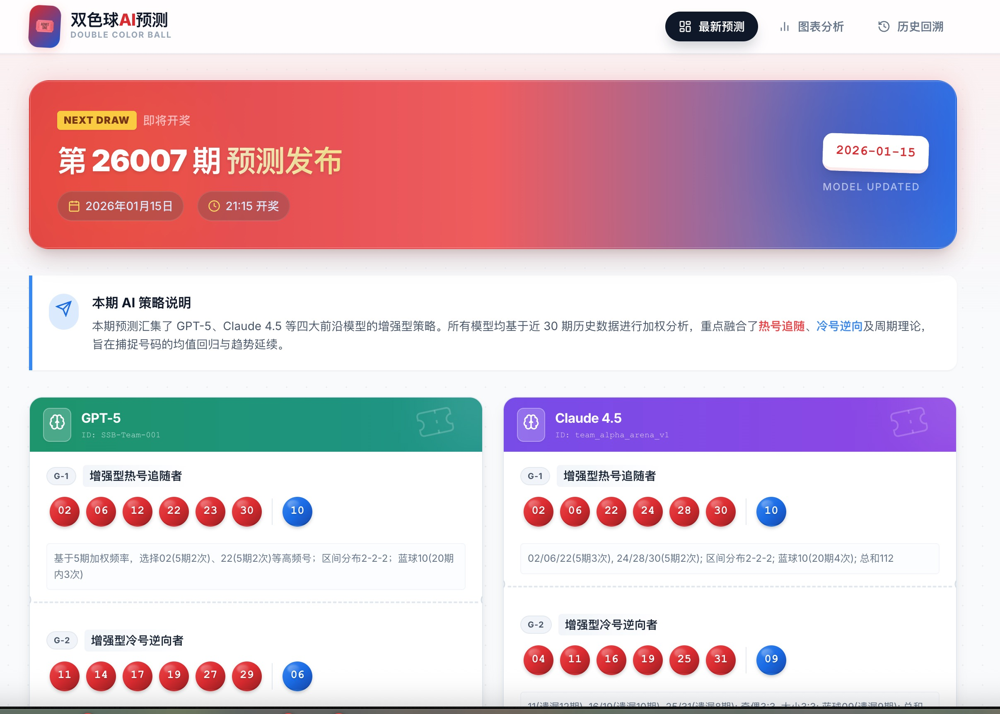

# 双色球 AI 预测

> 在线访问：[https://double-color-ball-ai.vercel.app](https://double-color-ball-ai.vercel.app)

一个基于 AI 模型的双色球彩票预测与数据分析展示平台，提供多模型预测对比、图表分析和历史命中回溯。



## ✨ 核心特性

- 🤖 **AI 模型预测** — SenseNova 6.7 Flash-Lite、DeepSeek V4 Flash 双模型预测
- 📊 **图表分析** — 红球热度、蓝球频率、奇偶比、和值走势、区间分布 5 类图表
- 🎯 **命中回溯** — 历史预测准确率统计与趋势分析
- ⏰ **自动数据更新** — GitHub Actions 每日爬取开奖数据
- 📧 **每日邮件推送** — SMTP 自动发送每日汇总邮件
- 🎨 **深色/浅色主题** — CSS 变量实现，偏好保存至 localStorage

## 🏗 项目结构

```
double/
├── index.html                    # 主页面（3 个 Tab）
├── css/
│   └── style.css                 # 样式（深色/浅色 CSS 变量）
├── js/
│   ├── app.js                    # 主应用逻辑 + Chart.js 图表
│   ├── components.js             # UI 组件（号码球、卡片、对比）
│   └── data-loader.js            # 数据加载模块（fetch JSON）
├── data/                         # 前端数据文件
│   ├── lottery_history.json      # 历史开奖数据 + 下期开奖信息
│   ├── ai_predictions.json       # 当前 AI 预测（未开奖期号）
│   └── predictions_history.json  # 历史预测对比（已开奖期号）
├── fetch_history/
│   ├── fetch_lottery_history.py  # 爬虫脚本（500 彩票网）
│   └── lottery_data.json         # 爬虫原始数据
├── doc/
│   ├── AI需求文档.md             # 原始需求文档
│   ├── prompt.md                 # Prompt v1.0（5 种基础策略）
│   └── prompt2.0.md              # Prompt v2.0（增强型 5 策略，主用）
├── .github/workflows/
│   ├── update-lottery-data.yml      # 爬虫：每天 UTC 14:00
│   ├── generate-ai-prediction.yml   # AI 预测：每周一三五 UTC 00:00
│   └── email-daily-digest.yml       # 邮件推送：每天 UTC 00:30
├── generate_ai_prediction.py         # AI 预测自动生成（主入口）
├── email_content_builder.py          # 邮件内容组装（纯函数模块）
├── email_daily_digest.py             # 每日邮件推送（主入口）
├── add_gpt5_prediction.py            # 手动添加历史预测
├── test_prediction.py                # 预测文件格式测试
├── test_single_model.py              # 单模型 API 调用测试
├── diagnose.js                       # 前端命中逻辑调试
├── deploy.sh                         # Vercel 部署辅助
├── vercel.json                       # Vercel 部署配置
├── start_server.sh / .bat            # 本地开发服务器
├── AI_PREDICTION_GUIDE.md            # AI 预测自动生成指南
├── AI_Prediction_Analysis_Report.md  # 历史预测分析报告
├── DATA_UPDATE_GUIDE.md              # 数据更新指南
├── DEPLOYMENT.md                     # Vercel 部署指南
├── .env.example / .env               # 环境变量
└── README.md                         # 本文件
```

## 🚀 快速开始

### 本地启动

```bash
# Windows
start_server.bat

# macOS/Linux
./start_server.sh

# 或手动
python3 -m http.server 8000
```

访问 `http://localhost:8000`

> ⚠️ **不能直接双击 `index.html`**，浏览器 CORS 限制会阻止加载本地 JSON 文件，必须通过 HTTP 服务器访问。

### 安装 Python 依赖

```bash
pip install openai requests beautifulsoup4
```

## 🤖 AI 预测生成

### 一键生成

```bash
# 设置环境变量
export AI_API_KEY="your-api-key"
export AI_BASE_URL="https://token.sensenova.cn/v1"

# 运行
python3 generate_ai_prediction.py
```

脚本自动完成：
1. 加载 Prompt 模板（`doc/prompt2.0.md`）
2. 读取最近 30 期历史数据
3. 自动归档已过期的旧预测 → 计算命中 → 写入 `predictions_history.json`
4. 依次调用 2 个 AI 模型，各生成 5 组预测
5. 验证数据格式并保存

### 模型配置

当前使用 2 个大模型，配置在 `generate_ai_prediction.py` 的 `MODELS` 数组中：

| 模型名称 | API ID | 数据标识 |
|---------|--------|---------|
| SenseNova 6.7 Flash-Lite | `sensenova-6.7-flash-lite` | `SenseNova6.7Flash` |
| DeepSeek V4 Flash | `deepseek-v4-flash` | `DeepSeekV4` |

> 每个模型生成 5 组预测，分别采用增强型热号追随、冷号逆向、平衡策略、周期理论、综合决策 5 种策略。详见 `doc/prompt2.0.md`。

## 🔄 数据更新工作流

```
开奖 (周二/四/日 21:15)
  ↓ 北京时间 22:00
[update-lottery-data.yml] 爬虫 → 更新 lottery_history.json
  ↓ 周一/三/五 北京 08:00
[generate-ai-prediction.yml] 归档旧预测 + 生成新预测
  ↓ 北京 08:30
[email-daily-digest.yml] 发送每日汇总邮件
  ↓
Vercel 自动重新部署
```

手动触发：在 GitHub Actions 页面点击对应工作流的 **Run workflow**。

## 📧 邮件推送

配置 SMTP 环境变量（详见 `.env.example`）：

```
SMTP_SERVER=smtp.qq.com
SMTP_PORT=465
SMTP_USER=your-qq-number@qq.com
SMTP_PASSWORD=your-qq-auth-code
EMAIL_RECIPIENT=recipient@example.com
EMAIL_DRY_RUN=true    # 设为 true 仅打印不发送
```

测试邮件：
```bash
EMAIL_DRY_RUN=true python3 email_daily_digest.py
```

## ⚙️ 环境变量

所有凭证通过环境变量注入，绝不硬编码。详见 `.env.example`：

| 变量 | 用途 | 使用方 |
|------|------|--------|
| `AI_API_KEY` | AI 模型调用凭证 | `generate_ai_prediction.py` |
| `AI_BASE_URL` | AI API 端点 | `generate_ai_prediction.py` |
| `SMTP_SERVER` / `SMTP_PORT` / `SMTP_USER` / `SMTP_PASSWORD` | 邮件配置 | `email_daily_digest.py` |
| `EMAIL_RECIPIENT` | 收件人 | `email_daily_digest.py` |
| `EMAIL_DRY_RUN` | `true` 仅打印不发送 | `email_daily_digest.py` |

GitHub Actions secrets 需同步配置同名字段。

## 🌐 部署

项目配置 `vercel.json`，从 GitHub 导入后每次 push 自动部署。

```bash
npm install -g vercel
vercel login
vercel --prod
```

详细指南见 [DEPLOYMENT.md](./DEPLOYMENT.md)。

## 📚 相关文档

| 文档 | 内容 |
|------|------|
| [AI_PREDICTION_GUIDE.md](./AI_PREDICTION_GUIDE.md) | AI 预测自动生成详细指南 |
| [AI_Prediction_Analysis_Report.md](./AI_Prediction_Analysis_Report.md) | 历史预测命中率分析报告 |
| [DATA_UPDATE_GUIDE.md](./DATA_UPDATE_GUIDE.md) | 数据更新操作指南 |
| [DEPLOYMENT.md](./DEPLOYMENT.md) | Vercel 部署指南 |
| [doc/prompt2.0.md](./doc/prompt2.0.md) | AI 预测 Prompt 模板（增强型 5 策略） |

## ⚠️ 免责声明

本项目仅供学习交流使用，不构成任何投资建议。彩票具有随机性，AI 预测仅为技术演示，不保证准确性。双色球开奖为随机事件，任何预测均无法保证命中。
